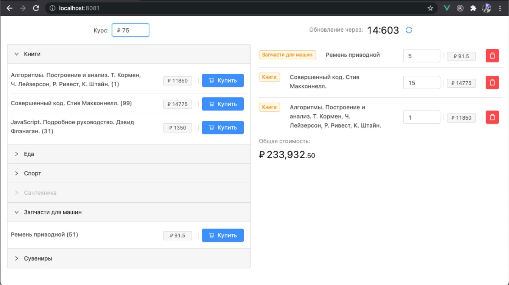

# Тестовое задание

## Deploy
https://test-store-vue2.netlify.app/



## Условие
Получить данные из файла ``data.json`` и вывести их на страницу как это показано на рисунке с левой
стороны.
Показанные на рисунке параметры находятся в узле Goods. "C" - цена в долларах(USD) - вывести в
рублях(курс выбрать произвольно), "G" - id группы, "T" - id товара, "P" - сколько единиц товара осталось
(параметр, который указан в скобках в названии).
Сопоставления id групп и товаров с их названиями находятся в файле ``names.json``
После вывода данных навесить обработчики для добавления выбранного товара в корзину и удаления из
нее. Пример корзины показан на рисунке с правой стороны. Сделать рассчет общей суммы товаров и
вывести отдельным полем. Корзина находится на одной и той же странице вместе со списком товаров.

## Задачи
- Вывести данные используя привязку к представлению и возможностью последующего изменения
(two-way binding);
- Сделать обновление цены товара в зависимости от курса валюты;
- С интервалом в 15 секунд читать исходный файл data.json и одновременно менять курс доллара
(вручную) на значение от 20 до 80, выполняя обновление данных в модели (с изменением в
представлении). Если цена увеличилось в большую сторону - подсветить ячейку красным, если в
меньшую - зеленым.

## Дополнительная информация
- Использовать Vue 2, Vuex;
- Можно использовать библиотеку компонентов;
- Дизайну, показанному в примере, следовать не обязательно;
- Прокомментировать основные действия. Интересные решения приветствуются.

## Project setup
```
npm install
```

### Compiles and hot-reloads for development
```
npm run serve
```

### Compiles and minifies for production
```
npm run build
```

### Lints and fixes files
```
npm run lint
```

### Customize configuration
See [Configuration Reference](https://cli.vuejs.org/config/).
